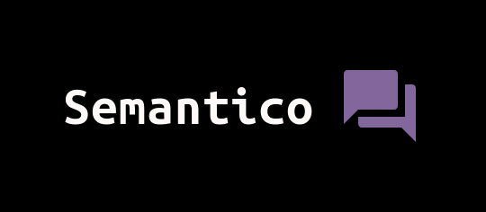
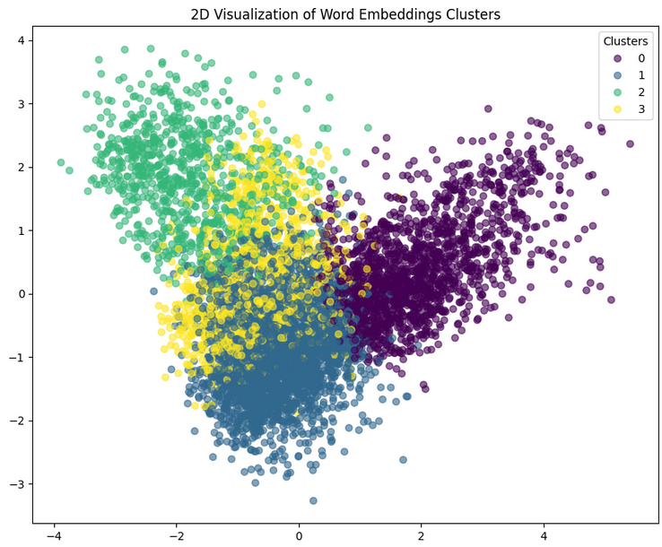

## Semantico
**Semantic similarity search from word embeddings**

 

### Why Semantic Search? 

Semantic search represents an advanced approach to search queries that focuses on understanding the context and intent behind a user's query, rather than relying solely on matching keywords. By leveraging natural language processing (NLP) and machine learning techniques, semantic search can interpret and analyze the nuances and meanings of words within the context, offering more accurate and relevant results. This capability makes it particularly valuable for addressing business problems, as it enhances user experience, improves the accuracy of search results, and boosts engagement by effectively understanding and responding to user needs. For businesses, implementing semantic search can lead to increased customer satisfaction, higher conversion rates, and a competitive edge in delivering content or products that truly meet user intentions and expectations.

### Data Collection & Wikipedia API

Through API calls, data was collected through the `wikipediaapi` python package [wikipedia-api](https://pypi.org/project/Wikipedia-API/). 

I chose to pull the `'Featured articles'` for this particular project as they consist of the highest quality data maintained by wiki editors. I provide a simple python script where you can call the Wikipedia API and collect your own data here with some slight modifications: [get_wiki_articles.py](get_wiki_articles.py)

It's important to follow the etiquette guideline when extracting/parsing data from Wikipedia. You should take time between requests or implement some form of rate limiting. It is not necessary to web scrape as you can collect quite a large amount of data in a short period through calling the API and Wikipedia prefers you to not web scrape and use the API instead. [API:Main](https://www.mediawiki.org/wiki/API:Main_page)

Refer to the etiquette guide here: [API:Etiquette](https://www.mediawiki.org/wiki/API:Etiquette) 

### Dataset

A zip file of the full dataset is provided in the repository in `json` format. Just clone down the repository and unzip `wiki_corpus.zip` in the `data` directory. 


### Data Cleaning

**Lowercasing Text**: Standardizing the case of the text to lowercase.

**Removing Special Characters and Punctuation**: Using `regex` to retain only alphanumeric characters and spaces, thus removing any form of punctuation or special characters.

**Replacing Line Breaks**: Converting newline characters `\n` into spaces to maintain sentence continuity.

This process was encapsulated within a `clean_text` function, which was then applied to the dataset to produce a cleaned version.

### Data Preprocessing Steps

**Tokenization**: Splitting the cleaned text into individual words or tokens using NLTK's `word_tokenize`.

**Stop Word Removal**: Eliminating common words that add little value to the analysis, such as "the", "is", etc., using NLTK's predefined list of stop words.

**Lemmatization**: Converting words to their base form, thus reducing the complexity of the vocabulary and consolidating similar forms of a word (e.g., "planning" to "plan"), using NLTK's `WordNetLemmatizer`.

### SentencePiece Tokenizer
|*"SentencePiece is an unsupervised text tokenizer and detokenizer mainly for Neural Network-based text generation systems where the vocabulary size is predetermined prior to the neural model training."*|
|:--:|


`SentencePiece` utilizes byte-pair encoding or `BPE` and in my provided [notebook](https://github.com/pyamin1878/Semantico/blob/main/notebooks/data_cleaning_preprocessing.ipynb), SentencePiece was employed to tokenize the preprocessed text data, showcasing its efficacy in creating a manageable and effective representation of text for machine learning models.

The `SentencePieceTrainer.train()` function was used with specified parameters such as input file, model prefix, and vocabulary size. This step is crucial as it adapts the model to the dataset's specific linguistic characteristics.

The `SentencePiece` model was then utilized to tokenize text into subwords or symbols, breaking down complex words into more manageable, model-friendly units. 

For a deeper dive into `BPE` and lossless tokenization refer to the blog post here: 

[Sentencepiece: A simple and language-independent subword tokenizer and detokenizer for neural text processing](https://medium.com/codex/sentencepiece-a-simple-and-language-independent-subword-tokenizer-and-detokenizer-for-neural-text-ffda431e704e)

### Modeling

#### Topic Modeling

Topic modeling is a powerful technique in natural language processing (NLP) that aids in discovering hidden thematic structures within a large corpus of text. It involves the identification of topics that represent a set of documents, enabling the summarization of large datasets by themes rather than through individual documents or words. The method for topic modeling I used is Non-negative Matrix Factorization `NMF`, which decomposes a document-term matrix into two lower-dimensional matrices, revealing the latent topics based on the occurrence of words within documents. By specifying the number of topics, `NMF` can extract and display the most significant words associated with each topic, providing a straightforward and interpretable summary of the main themes present in the text.

Results of the top 10 topics prevalent in our dataset:

```
Topic 1: ['state', 'would', 'new', 'president', 'government', 'party', 'american', 'united', 'war', 'election']
Topic 2: ['game', 'player', 'team', 'character', 'series', 'released', 'one', 'also', 'sonic', 'version']
Topic 3: ['film', 'character', 'role', 'time', 'one', 'scene', 'said', 'also', 'best', 'series']
Topic 4: ['specie', 'also', 'may', 'found', 'one', 'bird', 'used', 'known', 'year', 'two']
Topic 5: ['ship', 'fleet', 'gun', 'two', 'british', 'navy', 'battleship', 'sea', 'naval', 'squadron']
Topic 6: ['first', 'season', 'team', 'match', 'league', 'club', 'second', 'two', 'player', 'run']
Topic 7: ['album', 'song', 'music', 'band', 'released', 'single', 'first', 'record', 'one', 'number']
Topic 8: ['city', 'river', 'park', 'area', 'state', 'road', 'highway', 'north', 'building', 'new']
Topic 9: ['king', 'work', 'henry', 'year', 'first', 'one', 'also', 'time', 'england', 'later']
Topic 10: ['army', 'force', 'division', 'war', 'german', 'attack', 'battle', 'japanese', 'troop', 'battalion']
```
#### K-Means Clustering & PCA

In order to visualize our word embeddings we must reduce the dimensions of our data utilizing a technique called `PCA` with `K-Means`. Clustering and Principal Component Analysis (PCA) are powerful tools for analyzing and visualizing word embeddings. K-means is an unsupervised learning algorithm that groups similar data points into clusters, effectively categorizing words into distinct groups based on their embeddings, which capture semantic relationships. `PCA`, on the other hand, is a dimensionality reduction technique that simplifies the complexity of word embeddings by projecting them into a lower-dimensional space, making it easier to visualize and interpret the relationships between words. 



#### Approximate Nearest Neighbors aka Annoy

`Annoy` (Approximate Nearest Neighbors Oh Yeah) library, is a highly efficient method for finding near neighbors in high-dimensional space. Annoy is optimized for memory usage and speed, making it suitable for applications with large datasets, such as searching for similar documents based on their embeddings. By creating an index of document embeddings, `Annoy` allows for rapid querying of the dataset to find the closest embeddings to a given input vector, using either angular (cosine) or Euclidean distance metrics. This process involves building a forest of trees where each tree is an approximation of the dataset, enabling quick nearest neighbor searches even in very large datasets. In the provided [notebook](https://github.com/pyamin1878/Semantico/blob/main/notebooks/Modeling.ipynb), document embeddings are indexed using `Annoy`, and the index is queried to find the nearest neighbors to a specific document embedding.

### Best Model for Semantic Search

#### Sentence Transformers 

`SentenceTransformers` is a python framework for state-of-the-art sentence, text and image embeddings. The initial research is described in the paper "Sentence-BERT: Sentence Embeddings using Siamese BERT-Networks". [Sentence-BERT](https://arxiv.org/abs/1908.10084)

The framework can compute sentence and text embeddings for over 100 languages. 

I used these embeddings with cosine-similarity to find sentences with similar meaning, enabling semantic textual similarity and search.

`SentenceTransformers` is built on `PyTorch` and Transformers architecture. It offers many pre-trained models tuned for various tasks.

### Retrieval and Reranking 


In order to improve our semantic search, cross-encoders and bi-encoder models were implemented in a search pipeline with multiple models from `huggingface` hub:

[Bi-Encoder Model](https://huggingface.co/sentence-transformers/multi-qa-MiniLM-L6-cos-v1)

[Cross-Encoder Model](https://huggingface.co/cross-encoder/ms-marco-MiniLM-L-6-v2)

Chaining these two pre-trained models for complex search tasks can significantly improve semantic search as demonstrated by the custom pipeline built to retrieve our documents in our text corpus. Documentation on retrieval and reranking within the `SentenceTransformers` library can be found through the `SBERT` docs here: 

[Retrieval and Reranking](https://www.sbert.net/examples/applications/retrieve_rerank/README.html)

### Repo Structure

```
├── data
├── images
├── notebooks

├── .gitignore
├── README.md
├── Semantic_Search.ipynb                        ### Final Notebook
├── environment.yml                              ### env file
├── get_wiki_articles.py                         ### script for api call
```